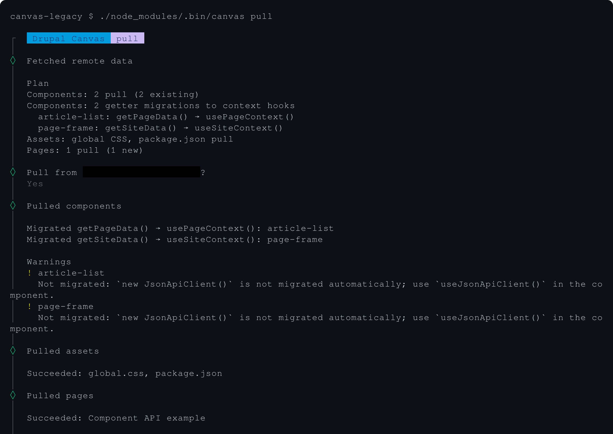

# #3592101 Testing guide

_90%+ written without AI_.

MR: https://git.drupalcode.org/project/canvas/-/merge_requests/1666

## Recorded QE results

The [guide-ordered report](guide-driven-qe-report.html) contains all eight executable
scenarios and sixteen separate terminal/browser videos. Section 2.2 remains
unsupported/N/A. Each recording retains its original revision; see the
[review summary](qe-review-summary.md) for published fixes, the Case 2.1-only
adjustment, local preview qualifications and the separate later Next production smoke.

## Prerequisites

1. Clone the following two repositories:
   1. https://github.com/balintbrews/canvas-3592101-legacy
   2. https://github.com/balintbrews/canvas-3592101-portable
2. Run `npm install` in both directories.
3. Copy their `.env.example` files in both as `.env`, and connect to your Drupal
   site that way.
4. Before the first push from `portable`, install JS packages from #3592101 (see
   "JS packages from #3592101" below).

## Terminology and expected behavior

### Canvas 1.11.0

A Canvas version that DOES NOT have the changes from this branch. The latest
tagged version before that is `1.11.0`, but you can use any version from `1.x`
prior to merging this branch.

### Canvas with #3592101

A Canvas version with changes from this branch. If you're testing before merging
this branch, that means a checkout of this branch, if you're testing afterwards,
that means a Canvas version — either a tagged version or a ref from `1.x` — that
already has these changes integrated.

### Local codebase

The codebase where your Code Components live, not the Canvas codebase. A local
codebase can be a default frontend or a headless frontend codebase.

### JS packages from #3592101

Refers to packages installed in your Local codebase (see above).

The JavaScript packages are released independently of Canvas itself, so we'll
need to test combinations. When the guide refers to JS packages from #3592101,
it means we're looking to use the `drupal-canvas` and `@drupal-canvas/*` npm
packages that contain the changes from this branch when testing with a local
codebase.

Before these packages are released, follow the
[local Canvas package setup instructions](https://gist.github.com/balintbrews/6b2355b6d74cc07cc721b618a1aa4dec).
Use a checkout of MR !1666 and its current full commit SHA as inputs. Apply the
setup to `portable` before its first push and to each new codebase that needs JS
packages from #3592101.

After merging and releasing the JS packages from this branch, be sure to use the
NEW package versions. Look for a commit in `1.x` with the subject of "chore:
version packages" which was created after the merge commit. That commit will
show you the NEW JS package versions as tags.

### Older JS packages

Refers to packages installed in your Local codebase (see above).

When the guide refers to Older JS packages, make sure to use released versions
of the `drupal-canvas` and `@drupal-canvas/*` npm packages prior to this branch.

Prior to merging and releasing the JS packages from this branch, this means the
latest tagged versions that an `npm install` gives you.

After merging and releasing the JS packages from this branch, be sure to use the
OLD package versions. Look for a commit in `1.x` with the subject of "chore:
version packages" which was created after the merge commit. That commit will
show you the NEW JS package versions as tags, so you'll need to use prior
versions to those.

### Clean Drupal installation

A clean Drupal installation means that the Drupal instance DOES NOT have any
Code Components. Note that a Drupal instance may have Code Components even if
none is visible under the _Code_ tab in Canvas: A connected headless frontend
can leave components as `type: external` which will not be listed once the
headless frontend is disconnected. The safest way is to re-install your Drupal
whenever this guide asks for a clean Drupal installation.

Whenever you re-install Drupal, please be sure to run `npm run build` from the
Canvas module's directory.

Set a site name and slogan at `/admin/config/system/site-information`.

Enable JSON:API and JSON:API Menu Items. Ensure the Article bundle has a body
field and a few published articles readable by the frontend's user. Generate
Article nodes with the Devel Generate module:

```bash
   ddev composer require drupal/devel && \
     ddev drush pm-install jsonapi jsonapi_menu_items devel devel_generate -y && \
     ddev drush devel-generate:content --bundles=article
```

### Example component tree

The test repositories provide an example page with example components that
output the followings:

- Site name
- Site slogan
- Theme logo URL
- Site menu (You may only see "Home" as the only menu item.)
- Current page title
  - Expected to be missing in Workbench
- Current entity UUID
  - Expected to be missing in Workbench
- A small example image outputted with the `Image` component
- A list of example articles (see Clean Drupal installation above for generating
  them)
  - Their body text is rendered by `FormattedText`

With Canvas 1.11.0, Workbench shows empty site-name, slogan and theme-asset
fallbacks because the older site-data endpoint requires authentication. Drupal
should still show those values. With Canvas with #3592101, Workbench should
receive live site metadata. Page title and entity remain absent in Workbench in
both cases.

### Code update/warning

When code from the `legacy` repository gets automatically updated during an
`npx canvas pull`, here is what to expect:

1. `article-list` comonent: `getPageData()` replaced by `usePageContext()`
   imported from `drupal-canvas/react`.
2. `page-frame` component: `getSiteData()` replaced by `useSiteContext()` from
   `drupal-canvas/react`.
3. `new JsonApiClient()` calls remain unchanged and receive manual-migration
   warnings.

Pull replaces the page and site getters with context hooks; `JsonApiClient`
constructors remain unchanged and receive migration warnings.



The components should be updated as follows:

```diff
--- a/src/components/article-list/index.jsx
+++ b/src/components/article-list/index.jsx
@@ -4,15 +4,15 @@
   FormattedText,
   getNodePath,
   Image,
-  getPageData,
   JsonApiClient,
 } from 'drupal-canvas';
+import { usePageContext } from 'drupal-canvas/react';

 import { DrupalJsonApiParams } from 'drupal-jsonapi-params';
 import useSWR from 'swr';

 export default function ArticleList({ resourceType, image, className }) {
-  const page = getPageData();
+  const page = usePageContext();
   const configured = /^node--[a-z][a-z0-9_]*$/.test(resourceType || '');
   const queryString = new DrupalJsonApiParams()
     .addFields(resourceType, [
--- a/src/components/page-frame/index.jsx
+++ b/src/components/page-frame/index.jsx
@@ -1,4 +1,5 @@
-import { cn, sortMenu, getSiteData, JsonApiClient } from 'drupal-canvas';
+import { cn, sortMenu, JsonApiClient } from 'drupal-canvas';
+import { useSiteContext } from 'drupal-canvas/react';

 import useSWR from 'swr';

@@ -18,7 +19,7 @@
 }

 export default function PageFrame({ menuName, content, className }) {
-  const site = getSiteData();
+  const site = useSiteContext();
   const { data, error, isLoading } = useSWR(
     menuName ? ['menu_items', menuName] : null,
     ([type, id]) => new JsonApiClient().getResource(type, id),
```

</details>

## Scenarios

When using local MR packages, follow the gist's
[after-pull instructions](https://gist.github.com/balintbrews/6b2355b6d74cc07cc721b618a1aa4dec)
after every `npx canvas pull`.

Before
[template PR11](https://github.com/drupal-canvas/headless-templates/pull/11)
merges, scaffold headless projects from its code rather than template `main`:

```bash
npx @drupal-canvas/create@latest --template nextjs --ref adr21-template-adoption-5a491e83
```

Use `--template tanstack-start` for the other React frontend. These JSX fixtures
exercise Next.js and TanStack Start only.

### 1. General smoke test

1. Start with a Clean Drupal installation using Canvas with #3592101.
2. Create a local codebase with Nebula (`npx @drupal-canvas/create@latest`).
3. Run `npx canvas reconcile-media -y && npx canvas push` to populate a Clean
   Drupal installation (see above) using Canvas with #3592101.
4. Move components around in Canvas, in and out of slots etc. Make sure
   everything works as before.
5. Open the in-browser code editor for a few components, and make sure their
   preview renders as before.

### 2. Testing with Canvas 1.11.0 and JS packages from #3592101

#### 2.1. Default frontend

1. Run `npx canvas reconcile-media -y && npx canvas push` from the `legacy`
   repository to populate a Clean Drupal installation using Canvas 1.11.0.
2. Verify the Example component tree (see above) in Drupal.
3. Create a local codebase with Nebula (`npx @drupal-canvas/create@latest`).
   1. Adjust it to use JS packages from #3592101.
4. Run `npx canvas pull --no-include-brand-kit`.
   Canvas 1.11.0 rejects OAuth on the Folder route. This excludes unrelated
   Brand Kit data while preserving component and page coverage.
5. **Code update/warning (see above) MUST NOT be happening.**
6. Verify the Example component tree (see above) in Workbench.
7. Run `npx canvas push`.
   1. The command should execute cleanly.
8. Verify the Example component tree (see above) in Drupal.

#### 2.2. Headless frontend

Pulling the components from the example repos into a headless codebase similar
to _2.2. Default frontend_ is not supported with Canvas 1.11.0. Nothing to test
here.

### 3. Testing with Canvas with #3592101 and JS packages from #3592101

#### 3.1. Default frontend starting from legacy components

1. Run `npx canvas reconcile-media -y && npx canvas push` from the `legacy`
   repository to populate a Clean Drupal installation using Canvas with
   #3592101.
2. Verify the Example component tree (see above) in Drupal.
3. Create a local codebase with Nebula (`npx @drupal-canvas/create@latest`).
   1. Adjust it to use JS packages from #3592101.
4. Run `npx canvas pull`.
5. **Code update/warning (see above) MUST be happening.**
6. Verify the Example component tree (see above) in Workbench.
7. Run `npx canvas push`.
   1. The command should execute cleanly.
8. Verify the Example component tree (see above) in Drupal.

#### 3.2. Headless frontend starting from legacy components

**Repeat** these steps for **Next.js and TanStack Start**.

1. Run `npx canvas reconcile-media -y && npx canvas push` from `legacy` to
   populate a Clean Drupal installation using Canvas with #3592101.
2. Verify the Example component tree in Drupal.
3. Create the headless codebase from PR11 as described above and install JS
   packages from #3592101.
4. Run `npx canvas pull`. Answer _yes_ to deleting unused local components, then
   follow the gist's after-pull instructions.
5. **Code update/warning (see above) MUST be happening.**
6. Manually replace the remaining constructors using the pattern in the
   `portable` examples: import `useJsonApiClient` from `drupal-canvas/react`,
   call it unconditionally in each component, and use its nullable client in the
   SWR key and fetcher. Keep the existing input checks and disable fetching when
   the client is null (for example,
   `menuName && client ? [client, 'menu_items', menuName] : null`).
7. Configure credentials, start the frontend and connect it in Drupal per the
   template README, with Canvas Headless enabled.
8. Visit `/component-api-example` on the frontend and in Canvas preview; verify
   the Example component tree there, including the menu request.

#### 3.3. Default frontend starting from portable components

1. Run `npx canvas reconcile-media -y && npx canvas push` from the `portable`
   repository to populate a Clean Drupal installation using Canvas with
   #3592101.
2. Verify the Example component tree (see above) in Drupal.
3. Create a local codebase with Nebula (`npx @drupal-canvas/create@latest`).
   1. Adjust it to use JS packages from #3592101.
4. Run `npx canvas pull`.
5. **Code update/warning (see above) MUST NOT be happening.**
   1. The code should already be in the updated form.
6. Verify the Example component tree (see above) in Workbench.
7. Run `npx canvas push`.
   1. The command should execute cleanly.
8. Verify the Example component tree (see above) in Drupal.

#### 3.4. Headless frontend starting from portable components

**Repeat** these steps for **Next.js and TanStack Start**.

1. Run `npx canvas reconcile-media -y && npx canvas push` from `portable`,
   already using JS packages from #3592101, to populate a Clean Drupal
   installation using Canvas with #3592101.
2. Verify the Example component tree in Drupal.
3. Create the headless codebase from PR11 as described above and install JS
   packages from #3592101.
4. Run `npx canvas pull`. Answer _yes_ to deleting unused local components, then
   follow the gist's after-pull instructions.
5. **Code update/warning (see above) MUST NOT be happening.** The code already
   uses nullable context/client hooks and gated fetching.
6. Configure credentials, start the frontend and connect it in Drupal per the
   template README, with Canvas Headless enabled.
7. Visit `/component-api-example` on the frontend and in Canvas preview; verify
   the Example component tree there, including the menu request.
